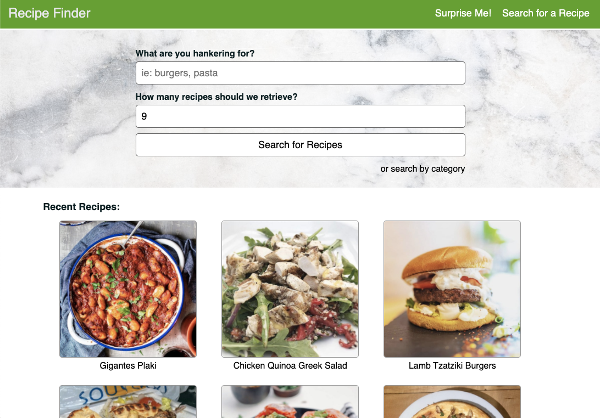
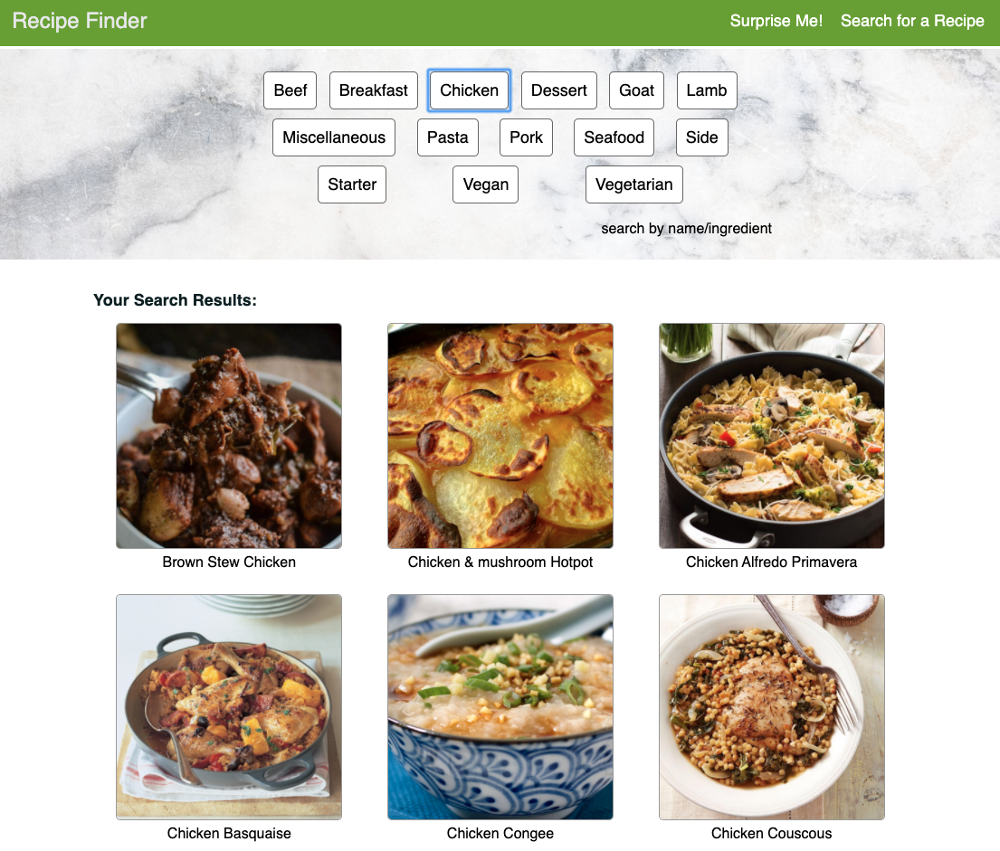
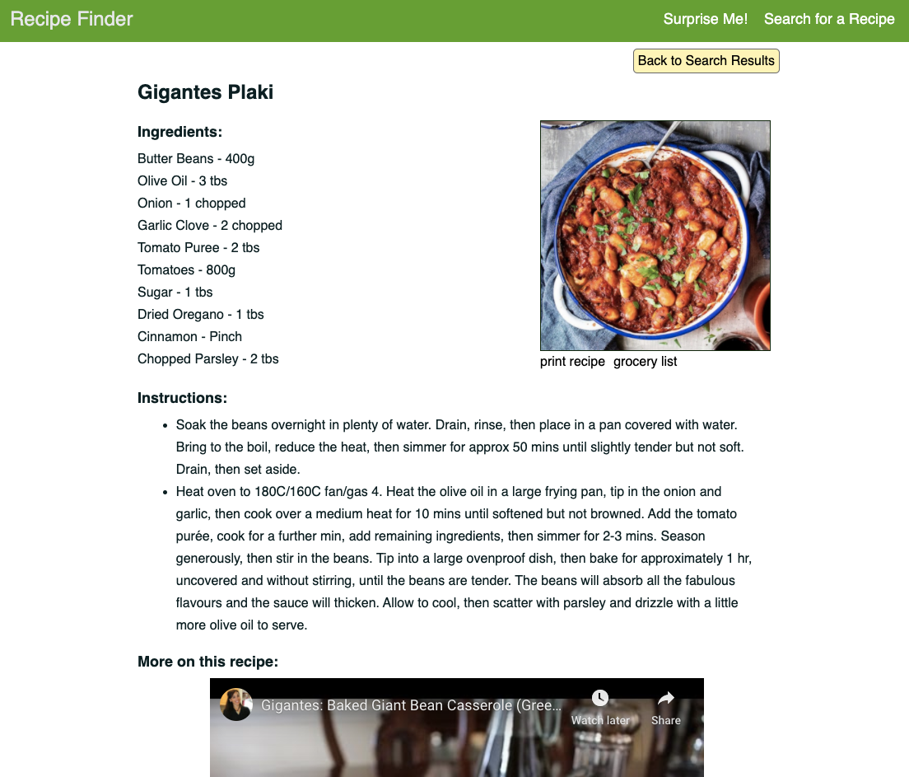
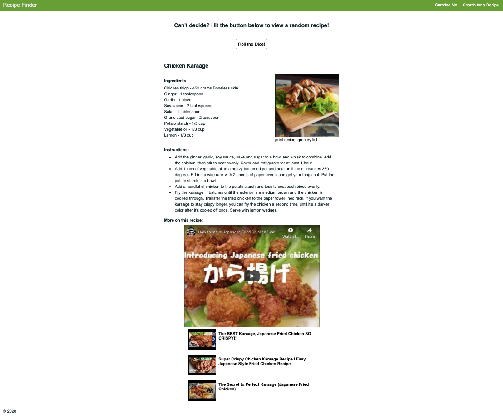
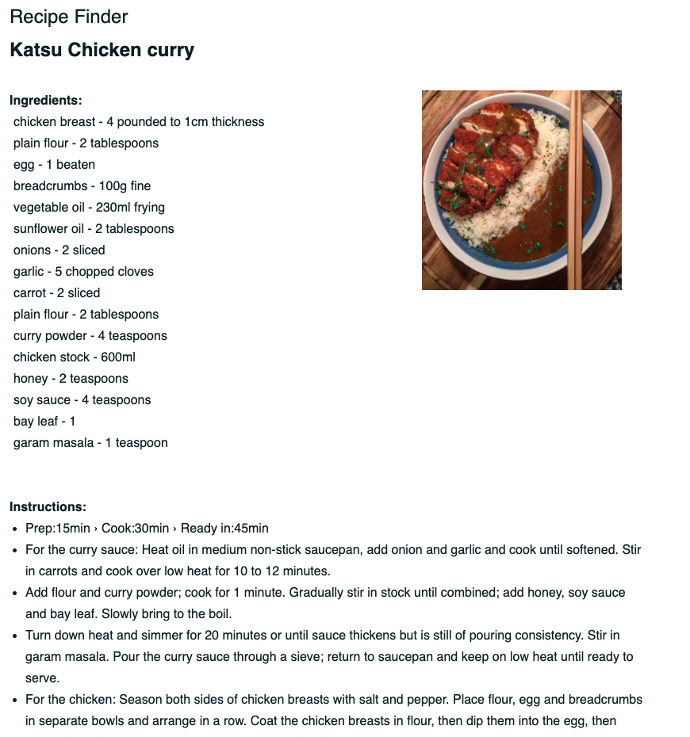
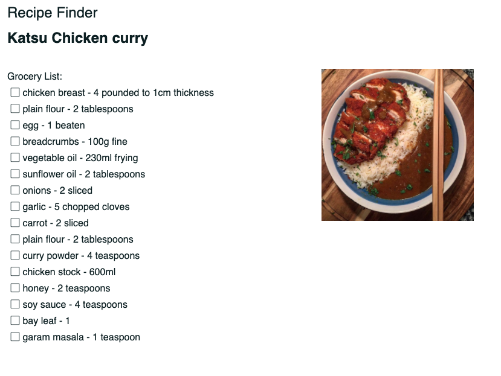

<!-- # book-thing.io

Initial wireframes:

https://wireframe.cc/x0a8I9

https://wireframe.cc/6oVXTU -->
# Summary

A light weight recipe finder application.

## Purpose

To provide as many tools to support a successful cooking experience. Users are able to: Search by recipe name, ingredients, or food/dish type. View the full recipe along with helpful videos. Print out the recipe or a simple grocery list.

## Screenshots
Homepage:

Search by Categories/Dish Type:

Full Recipe:

Recipe Randomizer:

Print Recipe:

Print Grocery List:

## Built With

### Front-End
* HTML/CSS
* JavaScript/jQuery

### APIs
* theMealDB
* YouTube

## Features

* Search for a Recipe by name, ingredients, dish type, food category
* For inspiration, view a random recipe from the recipe database
* View Full Recipe ingredients and instructions
* Watch the default recipe video or the top 3 video results from YouTube
* Print out the Recipe or a grocery list

## Demo

- [Live Demo](https://genkirawrs.github.io/recipe-finder/)

